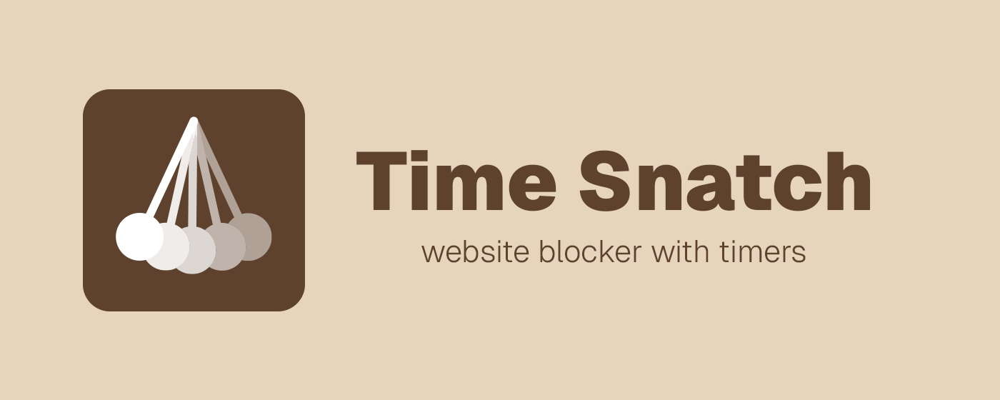

# Time Sntach - Time restrict websites, block websites and control your browsing patterns



Time Snatch allows you to limit the amount of time you spend on distracting websites.

You can limit the amount of time you can spend on distracting websites or outright block them. When navigating to a blocked website you will be redirected to a productive one of your choice or to our default inspiring web page that will throw motivating quotes at you.

Time Snatch is lightweight, reliable and secure. It gives you the flexibility to block and manage each website individually.

The "Read your browsing history" permission is needed to check whether the current website you are visiting matches any of the ones you have blocked. The extension never saves, sends or uses any of this information for other purposes.

## Install from Web Store

- [Chrome Web Store](https://chromewebstore.google.com/detail/time-snatch-block-website/epamlgdeklcjkldoaclgjdmjnchdgbho)
- [Firefox Add-Ons](https://addons.mozilla.org/en-US/firefox/addon/time-snatch-block-websites/)
- [Edge Add-Ons](https://microsoftedge.microsoft.com/addons/detail/time-snatch-block-websi/lpaajokgonohalagaibbjbnnelcdfckg)

## Install Locally (Chrome)

1. Download the latest .zip file version from [https://github.com/Thinkorswim/time-snatch/releases/tag/release](https://github.com/Thinkorswim/time-snatch/releases/tag/release)
2. Unzip the file and you should have a folder `time-snatch`
3. Move the folder to a permanent location on your computer (do not delete the folder after installation).
4. Go to the extensions page: chrome://extensions
5. Enable Developer Mode (toggle "Developer mode" at the top-right corner)
6. Click Load unpacked and select/open the extension folder (contains file manifest.json).


## Developer setup

The project has gone through multiple iterations and is now developed based on the [WXT Framework](https://wxt.dev/) with Vite and React. To start development or build from source follow the steps below:

1. Download and install Node.js from the [official website](https://nodejs.org/).
2. Clone the repository 

```
git clone https://github.com/Thinkorswim/time-snatch.git
``` 

3. Install dependencies 

```
cd time-snatch/TimeSnatch
npm install
```

4. Run the project

```
npm run dev
```

5. (Optional) Create a build from source

```
npm run build
```

This creates a `dist` folder which can be loaded unpacked into your browser extensions. Hot reloading development is available.
